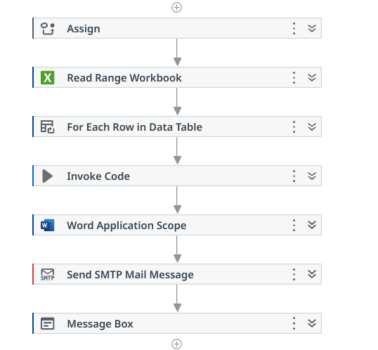
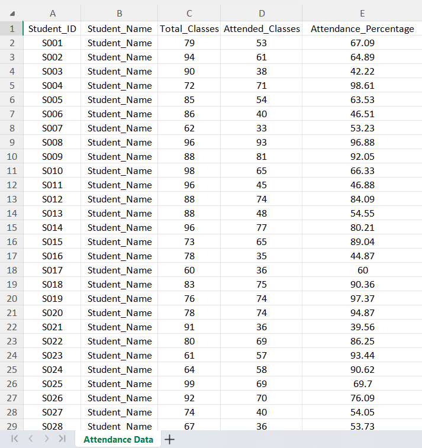
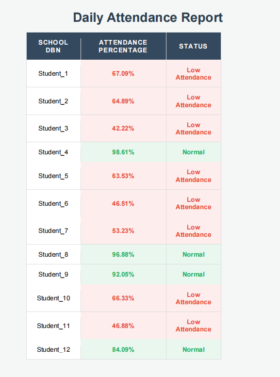
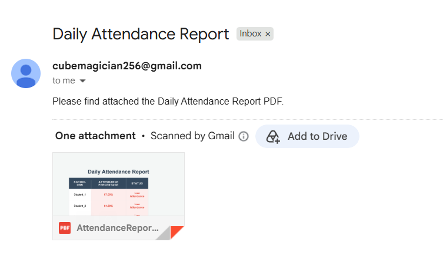

# Attendance Automation System using UiPath

## Project Overview
Attendance Automation System is an RPA-based project developed using UiPath to automate the attendance management and reporting process.

The system reads student attendance data from an Excel file, analyzes attendance percentage, generates automated reports in PDF format, and sends email notifications.

## Features

- Reads attendance data automatically from Excel
- Calculates attendance status
- Identifies students with low attendance
- Generates HTML/PDF attendance reports
- Sends reports through email automatically

## Technologies Used

- UiPath Studio
- Robotic Process Automation (RPA)
- Excel Automation
- HTML
- PDF Generation
- SMTP Email Automation

## Workflow

1. Import attendance data from Excel
2. Process student records using UiPath workflow
3. Check attendance percentage
4. Generate attendance report
5. Convert report into PDF
6. Send report through email

## Project Structure
Attendance-Automation-UiPath
│
├── Main.xaml
├── project.json
├── attendance.xlsx
├── AttendanceReport.pdf
└── README.md

## Output

The automation generates a PDF attendance report and sends it automatically through email.

## Author

Jayaprasath M

## Screenshots

### UiPath Workflow

### Attendance Input

### Generated Report

### Email Notification

